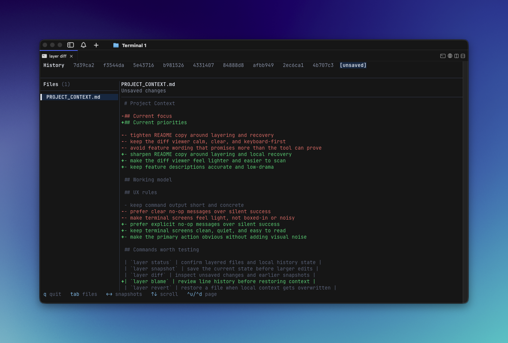

# layer

Manage `.git/info/exclude` so your personal AI files stay out of git — without touching `.gitignore`.

Developers drop personal context files into repos. `API_SPEC.md`, `BACKEND_GUIDE.md`, `onboarding-notes.md`, custom prompts, architecture docs. Everyone's got different ones. You can't keep adding each person's files to `.gitignore`. `layer` hides them locally using git's built-in exclude mechanism. No more bloating your team's `.gitignore`.

## Install

```bash
# macOS / Linux
curl --proto '=https' --tlsv1.2 -LsSf https://github.com/aungsiminhtet/git-layer/releases/latest/download/git-layer-installer.sh | sh

# Windows
powershell -ExecutionPolicy Bypass -c "irm https://github.com/aungsiminhtet/git-layer/releases/latest/download/git-layer-installer.ps1 | iex"

# From crates.io
cargo install git-layer
```

## Usage

```bash
layer scan                          # auto-detect AI context files and exclude them
layer add                           # interactive tree picker
layer add API_SPEC.md my-prompts/   # or add specific files
layer status                        # see layering state plus snapshot history status
```

That's it. The files disappear from `git status` and stay on disk.

### Toggle visibility

Editors (Cursor, Claude Code, Codex) respect git exclude rules — so layered files vanish from autocomplete and file pickers too. If you need to reference them while prompting:

```bash
layer off              # files reappear in editor
layer off CLAUDE.md    # or just one file
layer on               # re-hide before committing
```

### History tracking

Layered files are intentionally hidden from Git. That keeps them out of commits, but it also means Git cannot show you when one of those files gets rewritten, deleted, or trimmed.

`layer` keeps a private shadow history for those files, so you can inspect what changed and restore an earlier version when needed.

```bash
layer snapshot                  # save current state of all layered files
layer log                       # show change history
layer diff                      # interactive diff viewer (TUI in a terminal)
layer blame CLAUDE.md           # show per-line snapshot history
layer revert CLAUDE.md          # restore from previous snapshot
```

Snapshots are explicit by default. `layer` only auto-snapshots for `blame` (freshness) and `revert` (safety net).

`layer diff` opens an interactive terminal viewer for snapshot history and unsaved changes.



The shadow repo (`.layer/`) is local to your clone and initializes automatically on first snapshot.

## Commands

### Layering

| Command                | Description                                        |
| ---------------------- | -------------------------------------------------- |
| `layer add [files...]` | Exclude files (interactive tree picker if no args) |
| `layer rm [files...]`  | Remove entries (interactive if no args)            |
| `layer ls`             | List all managed entries with status               |
| `layer scan`           | Auto-detect known AI files and exclude them        |
| `layer status`         | Summary of layering state plus snapshot status     |

`layer scan` recognizes files from Claude Code, Cursor, Windsurf, Codex, Aider, Copilot, and many others. You can always add any file with `layer add <file>`.

### Visibility

| Command                | Description                                |
| ---------------------- | ------------------------------------------ |
| `layer off [files...]` | Temporarily un-hide entries                |
| `layer on [files...]`  | Re-hide disabled entries                   |
| `layer why <file>`     | Explain why a file is or isn't ignored     |
| `layer doctor`         | Find exposed, stale, and redundant entries |

### History

| Command               | Description                            |
| --------------------- | -------------------------------------- |
| `layer snapshot`      | Save current state of layered files    |
| `layer log [file]`    | Show snapshot history                  |
| `layer diff [file]`   | Show snapshot diff and unsaved changes |
| `layer blame <file>`  | Show per-line snapshot history         |
| `layer revert <file>` | Restore file from a previous snapshot  |

### Maintenance

| Command       | Description                                   |
| ------------- | --------------------------------------------- |
| `layer clean` | Remove entries for files that no longer exist |
| `layer clear` | Remove all managed entries                    |
| `layer edit`  | Open `.git/info/exclude` in `$EDITOR`         |

### Backup

| Command         | Description                         |
| --------------- | ----------------------------------- |
| `layer backup`  | Save entries to `~/.layer-backups/` |
| `layer restore` | Restore from a backup               |

### Global

`layer add` affects only the current repo. `layer global add` affects Git's global ignore file for all repos on this machine.

| Command            | Description                              |
| ------------------ | ---------------------------------------- |
| `layer global add` | Add entries to Git's global ignore file  |
| `layer global ls`  | List entries in Git's global ignore file |
| `layer global rm`  | Remove global ignore entries             |

## How it works

Git combines ignore rules from several places:

1. `.gitignore` files in the repo — tracked and shared with the team
2. **`.git/info/exclude`** — local to the repo on your machine, never shared (this is what `layer` manages by default)
3. Git's global ignore file — applies to all repos on this machine. Its path comes from `git config --global core.excludesFile`; if unset, Git commonly uses `~/.config/git/ignore`.

A file must be **untracked** for ignore rules to apply. If it's already tracked, `layer` will flag it as "exposed" and tell you how to fix it (`git rm --cached`).

## Terminology

- **Layered** — in `.git/info/exclude`, hidden from git
- **Exposed** — excluded but still tracked (needs `git rm --cached`)
- **Discovered** — known AI file on disk, not yet layered
- **Stale** — entry that no longer matches any file

## Development

```bash
cargo check
cargo test
cargo clippy --all-targets
cargo build --release
cargo install --path . --force
```

## License

MIT
